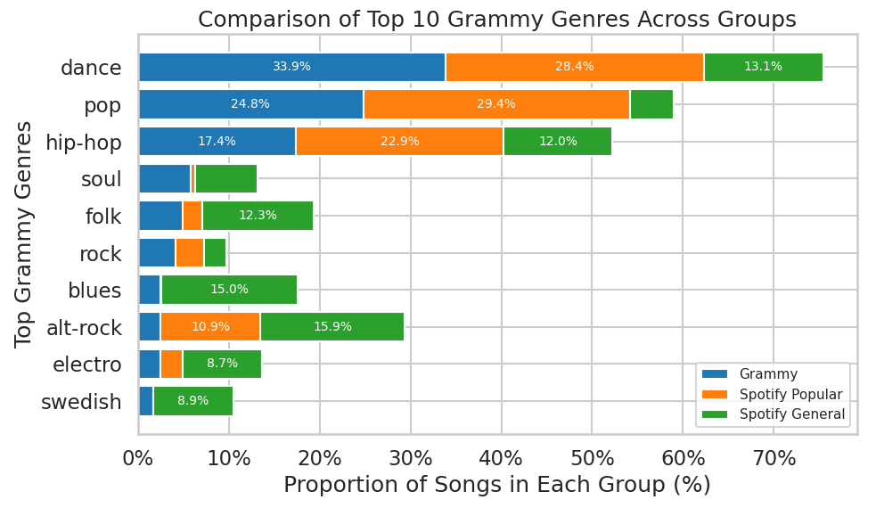
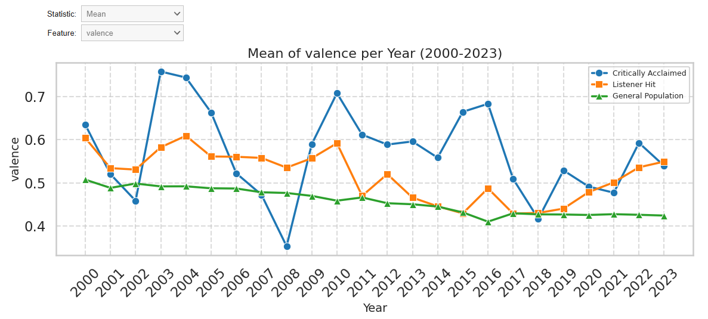

# 🎵 Grammy vs Spotify: Critical Acclaim vs Commercial Success

An end-to-end **data engineering and analytics pipeline** that investigates the divergence between critical acclaim (Grammy Award winners) and commercial success (Spotify popularity) in the music industry from **2000 to 2023**.

---

## 📌 Table of Contents
- [Overview](#overview)
- [Research Question](#research-question)
- [Tech Stack](#tech-stack)
- [Pipeline Architecture](#pipeline-architecture)
- [Dataset](#dataset)
- [Project Structure](#project-structure)
- [How to Run](#how-to-run)
- [Key Findings](#key-findings)
- [Challenges & Solutions](#challenges--solutions)

---

## Overview

This project builds a full ETL and EDA pipeline that ingests, cleans, and joins two large-scale music datasets — Grammy award records and Spotify audio features — to compare three distinct cohorts:

| Cohort | Description |
|---|---|
| **Critically Acclaimed** | "Record of the Year" Grammy winners (2000–2023) |
| **Listener Hits** | Top 100 most popular Spotify songs per year |
| **General Population** | Full Spotify dataset as a baseline control group |

The pipeline produces Parquet outputs used for interactive visualisations comparing audio features (valence, danceability, energy, tempo, etc.) across all three groups over a 23-year period.

---

## Research Question

> **Do Grammy-winning songs share the same audio characteristics as the most commercially popular songs on Spotify — or are critical acclaim and listener taste fundamentally different?**

---

## Tech Stack

| Technology | Role |
|---|---|
| **Apache Spark 3.5.1 / PySpark** | Distributed ETL, joins, window functions |
| **Google Colab** | Development environment & orchestration |
| **Google Drive** | Raw data lake (CSV input, Parquet output) |
| **Parquet** | Columnar storage for downstream analytics |
| **Pandas** | Post-Spark data manipulation |
| **Matplotlib / Seaborn** | Static and interactive visualisations |
| **ipywidgets** | Interactive dropdowns for EDA |

---

## Pipeline Architecture

```
Raw Data (Kaggle CSVs on Google Drive)
        │
        ▼
[ Phase 1 — Grammy Group ETL ]
  • Load & filter: "Record of the Year", 2000–2023
  • Regex cleaning: strip brackets, feat. credits
  • Normalise text: lowercase artist & track names
  • Inner join with Spotify on artist + track name
  • Manual index mapping for 41 unmatched edge cases
  • Output: grammy_group_parquet (130 rows, 29 cols)
        │
        ▼
[ Phase 2 — Spotify Group ETL ]
  • Custom CSV parsing: handle nested quotes & multiline fields
  • Window function: top 100 songs per year by popularity
  • Horizontal merge with Grammy group features
  • Output: spotify_group_parquet (2,400 rows, 29 cols)
        │
        ▼
[ Phase 3 — Visualisation (Pandas + Seaborn + ipywidgets) ]
  • Interactive line plot: mean/median audio features by year, per cohort
  • Stacked bar chart: genre distribution across all three groups
```

---

## Dataset

| Dataset | Source | Records | Size | Included |
|---|---|---|---|---|
| Grammy Winners & Nominees (1965–2024) | [Kaggle ↗](https://www.kaggle.com/datasets/johnpendenque/grammy-winners-and-nominees-from-1965-to-2024) | 25,370 | ~4 MB | ✅ `CloudData/grammy_winners.csv` |
| Spotify 1 Million Tracks | [Kaggle ↗](https://www.kaggle.com/datasets/amitanshjoshi/spotify-1million-tracks) | 1,159,764 | ~1.7 GB | ❌ Download separately (too large for GitHub) |

> **Note on Grammy dataset:** The Kaggle version has since been updated by its author. The exact version used in this project is included in `CloudData/` to ensure reproducibility.
>
> **Note on Spotify dataset:** Download `spotify_data.csv` from Kaggle and place it in `CloudData/` before running the notebook.

### Key Audio Features Analysed
`popularity` · `danceability` · `energy` · `loudness` · `speechiness` · `acousticness` · `instrumentalness` · `liveness` · `valence` · `tempo` · `duration_ms` · `time_signature`

---

## Project Structure

```
├── CloudTechProject.ipynb     # Full pipeline: ETL + EDA + visualisations
├── CloudData/
│   ├── grammy_winners.csv     # Included — exact version used in this project
│   └── spotify_data.csv       # ⚠️ Not included (1.7 GB) — download from Kaggle
└── README.md
```

> The notebook is best viewed and run on **Google Colab** (required for Drive mounting and ipywidgets interactivity).  
> [](https://colab.research.google.com/drive/1-jHhWqPNMHhQycjUWqTQrVUEU665RjKG?usp=sharing)

---

## How to Run

### Option A — Google Colab (recommended)

1. Download `spotify_data.csv` from [Kaggle](https://www.kaggle.com/datasets/amitanshjoshi/spotify-1million-tracks) and place it in a Google Drive folder named `CloudData/`
2. The `grammy_winners.csv` is already in this repo — upload it to the same `CloudData/` folder on Drive
2. Open `CloudTechProject.ipynb` in Google Colab
3. Run the first cell to mount your Google Drive
4. Run all cells in order — each phase is clearly labelled

### Option B — Local (Jupyter)

> Requires Java 11+ and PySpark installed locally.

```bash
# Install dependencies
pip install pyspark pandas matplotlib seaborn ipywidgets

# Launch notebook
jupyter notebook CloudTechProject.ipynb
```

> **Note:** The interactive `ipywidgets` dropdown visualisation requires the notebook to be run live (not just viewed as HTML). Static plots will render in any viewer.

---

## Key Findings

- **Genre gap:** Grammy winners skew heavily toward dance, pop, and hip-hop, but Spotify popular tracks show a more balanced genre spread.

- **Audio feature divergence:** Grammy-winning songs tend to have higher valence volatility year-over-year compared to the smoother trend in Spotify popular tracks — likely due to the small sample size (~5 winners per year).
- **Taste gap:** The "Listener Hits" cohort consistently aligns closer to the General Population in most audio features than to the Grammy cohort, suggesting critical acclaim and mainstream taste diverge meaningfully.


---

## Challenges & Solutions

**1. Complex CSV parsing in PySpark**  
Track names with nested quotes and multiline fields (e.g. classical music movements) caused column shifting during ingestion.  
→ Resolved with custom Spark read options: `.option("quote", '"').option("escape", '"').option("multiLine", True)`

**2. Cross-dataset entity resolution**  
Inconsistent naming conventions (`"Crazy in Love"` vs `"Crazy in Love (feat. Jay-Z)"`, `"Beyoncé"` vs `"Beyonce"`) caused join failures.  
→ Applied regex cleaning to strip bracket content and lowercased all strings before joining. Manually mapped 41 remaining edge-case records.

**3. Statistical comparability across cohorts of different sizes**  
Grammy group (~5 records/year) showed high volatility vs. the smooth General Population line (thousands/year), making visual comparison misleading.  
→ Plotted both mean and median to give a more robust picture, and noted sample size limitations in the analysis.

---

## Authors

- **Megha Kanojia** — [kanojiamegha326@gmail.com](mailto:kanojiamegha326@gmail.com)

